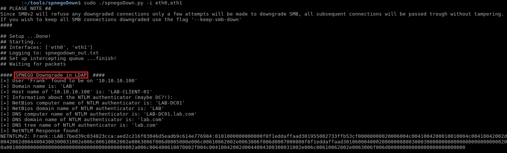

# spnegoDown

Microsoft's SPNEGO protocol is a less well known sub protocol used by higher level protocols (such as SMB, RPC, LDAP) to negotiate authentication. I have discovered weaknesses in the SPENGO protocol (and in the SMBv2 protocol), which enables a downgrade attack of the negotiated authentication scheme. This tool is aimed to provide a PoC downgrade attack against SPNEGO enabled negotiations.

## Technical Background

A blog post explained the technical background coming soon...

## Setup
The downgrade attack requires the attacker to be able to receive and modify network packets (best results can be achieved in a Man-in-the-Middle position).<br>
Just get yourself in a Windows domain network, intercept traffic from client to server and fire up the tool.

## The Tool: spnegoDown.py
### Prerequisites
The running machine requires the following setup:
- Python2
- Python2 nfqueue package
- Python2 scapy package

(The tool is currently based on Python2, due to legacy dependencies -- sorry for that)
### Usage
The tool requies root privileges and can be run in an interactive mode with:

```bash
sudo ./spnegoDown.py
```
Also possible:

```bash
sudo ./spnegoDown.py -i eth0,eth1 -l downgrade_out.txt
```
### Example Output

